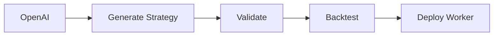
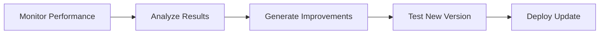

# Strategy Evolution System

## Overview

A self-improving trading system that uses OpenAI to generate, test, and evolve trading strategies, deploying successful ones as Cloudflare Workers.

## System Components

### 1. Strategy Generator Service
```python
class StrategyGenerator:
    def generate_strategy():
        # Use OpenAI to create new trading strategies
        # Return strategy as executable code
```

Key Features:
- Uses OpenAI to generate trading strategies in JavaScript (for Cloudflare Workers)
- Implements various trading patterns (Mean Reversion, Trend Following, etc.)
- Generates risk management rules
- Creates backtesting parameters

### 2. Strategy Validator Service
```python
class StrategyValidator:
    def validate_strategy(strategy_code):
        # Validate strategy code
        # Test for common issues
        # Return validation results
```

Validation Checks:
- Code security analysis
- Performance impact assessment
- Resource usage estimation
- Risk management validation

### 3. Backtesting Engine
```python
class BacktestEngine:
    def backtest_strategy(strategy, historical_data):
        # Run strategy against historical data
        # Calculate performance metrics
        # Return detailed results
```

Metrics Tracked:
- Sharpe Ratio
- Maximum Drawdown
- Win Rate
- Profit Factor
- Risk-Adjusted Return

### 4. Strategy Evolution Engine
```python
class StrategyEvolution:
    def evolve_strategy(strategy, performance_data):
        # Use OpenAI to improve strategy based on results
        # Return improved strategy
```

Evolution Parameters:
- Performance targets
- Risk limits
- Market conditions
- Trading costs

### 5. Cloudflare Worker Deployment System
```python
class WorkerDeployment:
    def deploy_strategy(strategy_code):
        # Deploy strategy as Cloudflare Worker
        # Monitor performance
        # Return deployment status
```

Deployment Process:
1. Package strategy code
2. Create Worker
3. Deploy to Cloudflare
4. Monitor execution

## Implementation Plan

### Phase 1: Strategy Generation

1. Create OpenAI Prompts:
```json
{
    "system": "You are an expert algorithmic trader...",
    "user": "Create a mean reversion strategy with the following parameters...",
    "parameters": {
        "timeframe": "5m",
        "risk_limit": 2,
        "target_profit": 1.5
    }
}
```

2. Strategy Template:
```javascript
export default {
    async fetch(request, env) {
        // Strategy implementation
    }
}
```

### Phase 2: Testing & Validation

1. Backtesting Infrastructure:
```python
def run_backtest(strategy_code, market_data):
    results = {
        'profit_loss': [],
        'trades': [],
        'metrics': {}
    }
    return results
```

2. Performance Metrics:
```python
def calculate_metrics(backtest_results):
    metrics = {
        'sharpe_ratio': 0,
        'max_drawdown': 0,
        'win_rate': 0
    }
    return metrics
```

### Phase 3: Evolution System

1. Performance Analysis:
```python
def analyze_performance(strategy_results):
    analysis = {
        'strengths': [],
        'weaknesses': [],
        'improvement_areas': []
    }
    return analysis
```

2. Strategy Improvement:
```python
def improve_strategy(analysis):
    prompt = create_improvement_prompt(analysis)
    improved_strategy = openai.chat.completions.create(
        model="gpt-4",
        messages=[
            {"role": "system", "content": "You are improving a trading strategy..."},
            {"role": "user", "content": prompt}
        ]
    )
    return improved_strategy
```

### Phase 4: Worker Deployment

1. Worker Creation:
```javascript
async function deployWorker(strategy) {
    const worker = new CloudflareWorker({
        name: `strategy-${strategy.id}`,
        code: strategy.code
    });
    return worker;
}
```

2. Monitoring System:
```javascript
class WorkerMonitor {
    constructor(worker) {
        this.worker = worker;
        this.metrics = {};
    }

    async monitor() {
        // Monitor worker performance
        // Collect metrics
        // Alert on issues
    }
}
```

## Evolution Process

1. Initial Strategy Generation:


2. Continuous Improvement:


## Performance Goals

1. Strategy Metrics:
```json
{
    "min_sharpe_ratio": 1.5,
    "max_drawdown": 0.15,
    "min_win_rate": 0.55,
    "min_profit_factor": 1.3
}
```

2. Evolution Targets:
```json
{
    "improvement_threshold": 0.1,
    "max_iterations": 10,
    "convergence_criteria": 0.02
}
```

## Implementation Example

1. Generate Strategy:
```python
async def generate_new_strategy():
    prompt = create_strategy_prompt()
    response = await openai.chat.completions.create(
        model="gpt-4o",
        messages=[
            {"role": "system", "content": "Create a trading strategy..."},
            {"role": "user", "content": prompt}
        ]
    )
    return parse_strategy(response)
```

2. Deploy as Worker:
```javascript
export default {
    async fetch(request, env) {
        const strategy = await loadStrategy();
        const market_data = await fetchMarketData();
        const signals = await executeStrategy(strategy, market_data);
        return new Response(JSON.stringify(signals));
    }
}
```

3. Monitor and Evolve:
```python
async def monitor_and_evolve():
    while True:
        performance = await monitor_strategy()
        if performance.needs_improvement():
            improved_strategy = await evolve_strategy()
            await deploy_new_version(improved_strategy)
        await asyncio.sleep(3600)  # Check hourly
```

## Security Considerations

1. Code Validation:
- Static analysis
- Sandbox testing
- Resource limits
- Access control

2. Deployment Safety:
- Gradual rollout
- Performance monitoring
- Automatic rollback
- Error thresholds

## Next Steps

1. Implementation Priority:
- Strategy Generator Service
- Backtesting Engine
- Worker Deployment System
- Evolution Engine
- Monitoring System

2. Development Phases:
- Phase 1: Basic strategy generation and testing
- Phase 2: Worker deployment and monitoring
- Phase 3: Performance analysis and evolution
- Phase 4: Full automation and optimization

3. Timeline:
- Week 1-2: Setup and basic implementation
- Week 3-4: Testing and validation
- Week 5-6: Evolution system
- Week 7-8: Production deployment

4. Success Metrics:
- Strategy performance improvement
- System stability
- Resource efficiency
- Trading profits
